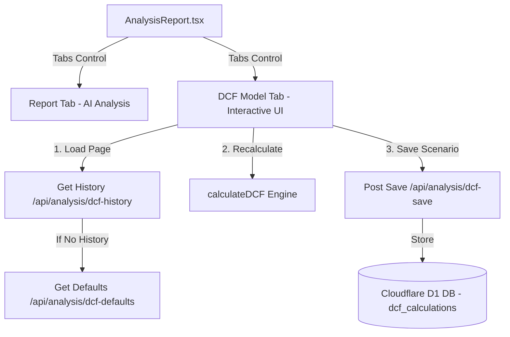

# Technical Specification: Interactive DCF Model & Scenario Persistence

เอกสารนี้ระบุรายละเอียดทางสถาปัตยกรรม (Architecture), โครงสร้างฐานข้อมูล (Database Schema), API Endpoints และตรรกะการคำนวณ (Calculation Engine) ของระบบ **Discounted Cash Flow (DCF) Model** ที่บันทึกและจำลองราคาหุ้นในระบบ Oaktree Agent

---

## 1. Overview (ภาพรวมระบบ)

ฟีเจอร์ DCF Model ออกแบบมาเพื่อให้นักลงทุนสามารถประเมินมูลค่าหุ้นของแต่ละบริษัทใน Watchlist ด้วยตนเองผ่านตัวเลือกจำลองสถานการณ์ที่ยืดหยุ่น (Interactive Scenario Modeling):
* **Interactive Engine:** ปรับเปลี่ยนค่าตัวแปรการเงินหลัก 10 รายการผ่านแถบเลื่อน (Sliders) และมองเห็นผลลัพธ์ (Implied Price / Upside %) ได้ทันที
* **Financial Defaults:** โหลดข้อมูลการเงินตั้งต้นของแต่ละหุ้นจากตารางสถิติตลาด (`market_stats`) อัตโนมัติ เพื่อให้ผู้ใช้ไม่ต้องกรอกข้อมูลตั้งแต่ศูนย์
* **Scenario Persistence:** ความสามารถในการบันทึกกรณีวิเคราะห์แบบเจาะจง (เช่น Base Case, Bull Case, Bear Case) ลงฐานข้อมูล และเรียกประวัติการวิเคราะห์เดิมกลับมาแสดงผลบนเครื่องมือปรับแต่งได้ในคลิกเดียว

---

## 2. Architecture & Components (สถาปัตยกรรมและส่วนประกอบ)

ระบบมีการทำงานประสานกันผ่านเลเยอร์ต่างๆ ดังนี้:



### A. โครงสร้างไฟล์ที่เกี่ยวข้อง
* **Database & Migration:**
  * [0024_dcf_calculations.sql](file:///c:/Users/natta/Documents/oaktree-agent/backend/migrations/0024_dcf_calculations.sql): สคริปต์การทำ Migration ตารางจัดเก็บตัวแปรและผลลัพธ์ของ DCF
* **Backend API:**
  * [index.ts](file:///c:/Users/natta/Documents/oaktree-agent/backend/src/index.ts): กำหนด Hono API Endpoints สำหรับดึงค่าดีฟอลต์, เรียกดูประวัติการวิเคราะห์ และบันทึกผล
* **Frontend UI Components:**
  * [DCFModel.tsx](file:///c:/Users/natta/Documents/oaktree-agent/frontend/src/components/features/agent/DCFModel.tsx): หน้าจออินเทอร์เฟซหลัก, ตัวสไลเดอร์, ฟังก์ชันคณิตศาสตร์คำนวณ DCF, กราฟ SVG แบบ Custom และตาราง Forecast Grid
  * [AnalysisReport.tsx](file:///c:/Users/natta/Documents/oaktree-agent/frontend/src/components/features/agent/AnalysisReport.tsx): คอนเทนเนอร์หลักที่รวมแท็บรายงานวิเคราะห์ของ AI และส่วน DCF เข้าด้วยกัน

---

## 3. Database Schema (โครงสร้างฐานข้อมูล)

ใช้ฐานข้อมูล Cloudflare D1 (SQLite) โดยจัดเก็บพารามิเตอร์ของแบบจำลองทั้งหมดลงในตาราง `dcf_calculations`:

### ตาราง `dcf_calculations`
```sql
CREATE TABLE IF NOT EXISTS dcf_calculations (
  id INTEGER PRIMARY KEY AUTOINCREMENT,
  symbol TEXT NOT NULL,                                -- ตัวย่อหุ้น (เช่น AAPL)
  scenario_name TEXT NOT NULL DEFAULT 'Base Case',     -- ชื่อชุดจำลองสถานการณ์
  base_revenue REAL NOT NULL,                          -- รายได้ปีฐาน (หน่วย: พันล้านดอลลาร์ $B)
  revenue_growth REAL NOT NULL,                        -- อัตราการเติบโตของรายได้ (% ต่อปี)
  base_gross_margin REAL NOT NULL,                     -- อัตรากำไรขั้นต้นเริ่มต้น (%)
  gross_margin_improvement REAL NOT NULL,              -- การปรับปรุงอัตรากำไรขั้นต้นต่อปี (%)
  opex_margin REAL NOT NULL,                           -- อัตราค่าใช้จ่ายดำเนินงานต่อรายได้ (%)
  tax_rate REAL NOT NULL,                              -- อัตราภาษี (%)
  fcf_conversion REAL NOT NULL,                        -- อัตราการแปลง NOPAT เป็น FCF (%)
  wacc REAL NOT NULL,                                  -- ต้นทุนเงินทุนเฉลี่ย WACC (%)
  terminal_growth REAL NOT NULL,                       -- อัตราการเติบโตแบบถาวร Terminal Growth (%)
  shares_outstanding REAL NOT NULL,                    -- จำนวนหุ้นทั้งหมด (หน่วย: ล้านหุ้น)
  implied_share_price REAL NOT NULL,                   -- ราคาหุ้นเป้าหมายที่คำนวณได้
  created_at TEXT DEFAULT (datetime('now'))            -- วันเวลาที่บันทึกข้อมูล (ISO-8601 String)
);

CREATE INDEX IF NOT EXISTS idx_dcf_calculations_symbol ON dcf_calculations (symbol);
```

---

## 4. API Specification

จุดเชื่อมต่อข้อมูลระหว่าง Frontend และ Backend ประกอบด้วย:

| Method | Path | Parameter / Body | Description |
| :--- | :--- | :--- | :--- |
| **`GET`** | `/api/analysis/dcf-defaults` | `?symbol=XYZ` | ดึงสถิติตลาดจากฐานข้อมูลมาประมวลผลเป็นตัวแปรเริ่มต้นให้กับ Model |
| **`GET`** | `/api/analysis/dcf-history` | `?symbol=XYZ` | ดึงประวัติการเซฟข้อมูลทั้งหมดของหุ้นตัวนั้น เรียงตามล่าสุดก่อน |
| **`POST`** | `/api/analysis/dcf-save` | *JSON Body* (ดูด้านล่าง) | บันทึกชุดพารามิเตอร์และผลลัพธ์การประเมินมูลค่าลงในระบบ |

### ตัวอย่าง JSON Body สำหรับ `POST /api/analysis/dcf-save`
```json
{
  "symbol": "TSLA",
  "scenarioName": "Bull Case 2026",
  "baseRevenue": 96.77,
  "revenueGrowth": 15.0,
  "baseGrossMargin": 18.5,
  "grossMarginImprovement": 1.2,
  "opexMargin": 10.5,
  "taxRate": 15.0,
  "fcfConversion": 90.0,
  "wacc": 10.5,
  "terminalGrowth": 2.5,
  "sharesOutstanding": 3189,
  "impliedSharePrice": 245.50
}
```

---

## 5. Calculation Engine (เครื่องมือคำนวณ DCF)

การคำนวณประมาณการทางการเงินล่วงหน้า 5 ปี (ปี 2026 ถึง 2030) อยู่ในฟังก์ชัน `calculateDCF` ของไฟล์ `DCFModel.tsx` มีรายละเอียดดังนี้:

### A. ซอร์สโค้ดฟังก์ชันคำนวณ
```typescript
function calculateDCF(params: DCFParams): DCFResult {
  const results: YearlyData[] = [];
  let currentRev = params.baseRev;
  let pvOfFcfSum = 0;

  // ประมาณการล่วงหน้า 5 ปี (2026-2030)
  for (let i = 0; i < 5; i++) {
    const year = 2026 + i;
    if (i > 0) {
      currentRev = currentRev * (1 + params.revGrowth); // โตขึ้นตามอัตราการเติบโต
    }
    const currentGm = params.baseGm + i * params.gmImprovement; // Gross Margin ดีขึ้นเรื่อยๆ
    const ebit = currentRev * (currentGm - params.opexMargin);  // กำไรดำเนินงาน
    const nopat = ebit * (1 - params.taxRate);                 // กำไรหลังหักภาษี
    const fcf = nopat * params.fcfConversion;                  // แปลงเป็น Free Cash Flow
    const discountFactor = Math.pow(1 + params.wacc, i + 1);   // ตัวคูณลดค่าเงินตาม WACC
    const pvOfFcf = fcf / discountFactor;                      // มูลค่าปัจจุบันของ FCF
    pvOfFcfSum += pvOfFcf;

    results.push({ year, revenue: currentRev, grossMargin: currentGm, ebit, fcf, pvOfFcf });
  }

  // คำนวณมูลค่าสุดท้าย (Terminal Value) ณ ปีที่ 5
  const lastFcf = results[4].fcf;
  const terminalValue =
    (lastFcf * (1 + params.terminalGrowth)) / (params.wacc - params.terminalGrowth);
  const pvOfTerminalValue = terminalValue / Math.pow(1 + params.wacc, 5);
  
  // คำนวณมูลค่ากิจการและมูลค่าต่อหุ้น
  const enterpriseValue = pvOfFcfSum + pvOfTerminalValue;
  const impliedSharePrice = (enterpriseValue * 1000) / params.sharesOutstanding;

  return { yearlyData: results, enterpriseValue, impliedSharePrice, pvOfTerminalValue };
}
```

### B. สูตรการคำนวณที่สำคัญ
1. **Free Cash Flow (FCF) แต่ละปี:**
   $$\text{FCF} = \text{Revenue} \times (\text{Gross Margin} - \text{OpEx Margin}) \times (1 - \text{Tax Rate}) \times \text{FCF Conversion}$$
2. **Present Value of FCF (PV of FCF):**
   $$\text{PV of FCF}_t = \frac{\text{FCF}_t}{(1 + \text{WACC})^t}$$
3. **Terminal Value (Gordon Growth Model):**
   $$\text{Terminal Value} = \frac{\text{FCF}_5 \times (1 + g_{\text{terminal}})}{\text{WACC} - g_{\text{terminal}}}$$
4. **Implied Share Price (ราคาเป้าหมายต่อหุ้น):**
   $$\text{Implied Price} = \frac{(\sum \text{PV of FCF} + \text{PV of Terminal Value}) \times 1,000}{\text{Shares Outstanding}}$$

---

## 6. Frontend Interactive Logic & UI Flow (การทำงานฝั่งผู้ใช้)

### A. ลำดับการดาวน์โหลดข้อมูลเริ่มต้น (Initial Load Sequence)
1. หน้าจอทำการส่ง Request ไปยัง `/api/analysis/dcf-history?symbol=XXX`
2. **กรณีมีประวัติการเซฟข้อมูลมาก่อน (Has Saved Scenarios):**
   - นำข้อมูลพารามิเตอร์จาก **แถวแรก (ล่าสุด)** มาประมวลผลเป็นค่าเริ่มต้นในระบบสไลเดอร์ทันที เพื่อให้ผู้ใช้งานทำงานต่อจากเดิมได้ง่ายที่สุด
3. **กรณีไม่มีข้อมูลประวัติย้อนหลัง (New Analysis):**
   - ส่ง Request ไปดึงค่า Default ทางการเงินจาก `/api/analysis/dcf-defaults?symbol=XXX`
   - นำค่าสถิติจากงบการเงินจริงมาแปลงหน่วย (เช่น หารายได้ด้วย $10^9$ เพื่อปรับเป็นหน่วย $B)
   - ประมาณค่าจำนวนหุ้นเบื้องต้นโดยนำ Market Cap หาราคาล่าสุด และกำหนดค่า Conversion และ Margin เริ่มต้นให้อยู่ในเกณฑ์มาตรฐานของอุตสาหกรรม

### B. ส่วนประกอบหน้าจอการปรับแต่ง (Interactive UI Grid Layout)
UI หน้าจอนี้ออกแบบตามสไตล์ **Antigravity UI (MUI Joy UI)** แบบ Responsive โดยแบ่งพื้นที่หลักเป็น 2 ฝั่งเมื่อแสดงผลบนจอคอมพิวเตอร์:

1. **Left Input & Scenarios Control Panel (ฝั่งซ้าย - 340px):**
   - **Financial Sliders:** แถบสไลด์ปรับแก้ค่าตัวแปรทั้ง 10 รายการ พร้อม Tooltip อธิบายความหมายและปุ่มปรับละเอียดตัวเลขข้างสไลเดอร์
   - **Save Scenario Controls:** ฟิลด์พิมพ์ชื่อ Scenario (เช่น Base/Bull/Bear) พร้อมปุ่มบันทึก ซึ่งจะส่ง POST API ไปเก็บในฐานข้อมูล
   - **Saved Scenarios History:** รายการประวัติวิเคราะห์ย้อนหลัง แสดงชื่อกรณี วันที่ และราคาผลลัพธ์ เมื่อคลิกจะทำการรีโหลดตัวปรับสไลเดอร์ทั้งหมดให้ตรงกับข้อมูลชุดนั้นๆ ทันที
2. **Right Visualization Panel (ฝั่งขวา):**
   - **Metrics Summary Cards:** การ์ดคำนวณสรุปราคาผลลัพธ์เป้าหมาย (Implied Price) เทียบกับราคาจริงเพื่อบอก % Upside/Downside สีสันตามทิศทางตลาด (เขียว/แดง) พร้อมทั้งบอก Enterprise Value และเป้าหมาย FCF ปีสุดท้าย
   - **Responsive SVG Chart:** กราฟจำลองสถานการณ์ที่เรนเดอร์ผ่าน SVG ดิบของ React แสดงปริมาณรายได้ (Revenue) แบบแท่งคู่ขนานกับการคาดการณ์กระแสเงินสดอิสระ (FCF) แบบเส้นพื้นที่ (Area Graph)
   - **Detailed Forecast Table:** ตารางจำลองงบการเงินอย่างละเอียด 5 ปีล่วงหน้า แสดงตัวเลขทีละบรรทัดตั้งแต่รายได้ลงไปจนถึงมูลค่าปัจจุบันของกระแสเงินสดอิสระ (PV of FCF) เพื่อการวิเคราะห์ที่แม่นยำ