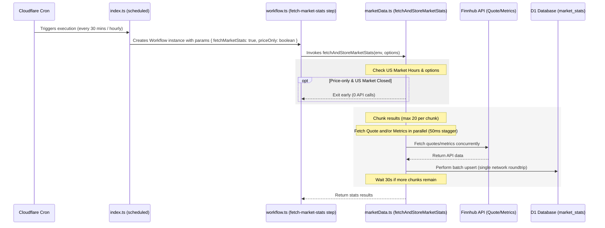

# Watchlist Price & Metrics Sync Optimization Spec

This specification details the design and implementation of the optimized watchlist price and metrics sync system, which maintains fresh prices and updates fundamental metrics daily while staying well within the Finnhub API free-tier quota (60 requests/minute).

## 1. Overview & Architecture

To prevent API rate limit collisions and minimize compute/network overhead, the sync system is split into two logical schedules running under Cloudflare Workers Workflows:

1. **Price-Only Mode (Every 30 mins, `*/30 * * * *`)**:
   - Updates real-time quotes (prices) for all active watchlist symbols.
   - Runs during US market hours and post-market grace period (9:30 AM – 4:30 PM ET). Exits early with 0 API calls when the market is closed or on weekends.
   - At 4:30 PM ET (`16:30`), the last price-only run executes to capture final post-close settlement prices.
   - At minute 0, it skips price fetching to avoid duplicating the hourly sync run.

2. **Hourly Tasks & Rolling Metrics Sync (Hourly, `0 * * * *`)**:
   - **During Market & Grace Hours (9:30 AM – 4:30 PM ET)**: Updates prices for active symbols (`priceOnly: false`) and triggers downstream tasks (alert rule checks, news crawler, email digests).
   - **During Off-Hours (Starting 5:00 PM ET / 17:00 ET)**: Skips price fetching entirely (0 quote calls). Instead, it runs the **Rolling Metrics Sync** which fetches fundamental metrics for the **15 oldest/missing symbols** on the watchlist.
   - *Result*: All 100 symbols have their fundamentals updated daily within the first 7 hours after market close (starting at 5:00 PM ET). On weekends, no metrics or price syncs are requested (0 API calls).

### Watchlist Scale Bounds
The total size of the watchlist database is capped at a maximum of **100 symbols** (user/system-wide limit) to keep resource usage and execution times bounded.

---

## 2. API Quota Optimization & Guardrails

To prevent exceeding the Finnhub API limits, five optimization mechanisms are enforced:

### A. US Market Hours Filter
Since the workspace monitors US stocks, the price sync check is skipped if the US stock market is closed.
* **Open & Grace Period Hours**: Monday to Friday, 9:30 AM – 4:30 PM Eastern Time (ET). Includes a 30-minute post-market grace period (until 4:30 PM ET) to ensure official closing prices settle and are fully captured.
* **Implementation**: The helper function `isUSMarketOpen()` evaluates time using the `America/New_York` timezone via `Intl.DateTimeFormat` to automatically account for Daylight Saving Time (EDT vs EST) transitions. If evaluated to false outside these hours or on weekends, price-only runs exit early.

### B. Dynamic Fetch Directives
We split fetching logic inside the sync loop based on market state:
* When the US market is open: `shouldFetchQuote = true`, `shouldFetchMetrics = false`.
* When the US market is closed: `shouldFetchQuote = false`, `shouldFetchMetrics = true` (only for the 15 prioritized symbols).

### C. Selective D1 Database Upsert
The D1 SQLite upsert query utilizes `CASE` and `COALESCE` statements to selectively update fields and preserve existing values:
* Price fields are updated only if new quotes are fetched; otherwise, `COALESCE(excluded.price, market_stats.price)` preserves existing prices.
* Fundamental metrics are updated only if new metrics are fetched; otherwise, the existing values are preserved.

### D. Safe Parallel Chunking & Stagger
To stay well within Finnhub's rate limit of 60 requests/minute, the sync logic processes symbols in parallel but with strict rate-limiting guardrails:
* The active list is divided into groups of **max 20 symbols** per chunk.
* Within each chunk, requests are triggered concurrently using `Promise.all` but staggered by **50ms** (`await delay(idx * 50)`) to avoid hitting burst rate limiters.
* Between sequential chunks, a safe delay of **30 seconds** is introduced (`await delay(30000)`).
* This limits the maximum API request rate to **~40 requests/minute** (33% safety headroom), leaving 20 requests/minute for concurrent user manual requests.

### E. Batched D1 Database Operations
To minimize database connection overhead and latency, database writes are batched where possible:
* **Market Stats Upserts**: All `market_stats` SQL upsert statements for a chunk are compiled into an array and executed in a single transaction via the D1 Batch API (`await env.DB.batch(batchStatements)`).
* **Alert Engine Updates**: In [alerts.ts](file:///c:/Users/natta/Documents/oaktree-agent/backend/src/alerts.ts), all database writes (updating rule checked states, values, and inserting triggered notification records) are accumulated into an array and executed together in a single transaction via the D1 Batch API at the end of the rule checking run.

### F. Pre-fetching Breakout Events
To avoid sequential, inline database `SELECT` queries inside the breakout detection loop for each symbol, all `record_breaker_events` recorded for the current date are pre-fetched at the start of the execution in [marketData.ts](file:///c:/Users/natta/Documents/oaktree-agent/backend/src/marketData.ts) and stored in an in-memory `Set`. The loop queries this `Set` for event existence, reducing sequential breakout check `SELECT` queries to zero.

---

## 3. Data Flow & Invocation

---

## 4. API Budget Analysis

Assuming **100 symbols** (the maximum limit) in the watchlist:

* **US Market Open Hours**:
  - **Minute 0 (Hourly Sync)**: `100` Quote API calls. Total: **100 calls** (spread over ~2 minutes).
  - **Minute 30 (Price-Only Sync)**: `100` Quote API calls. Total: **100 calls** (spread over ~2 minutes).
  - *Note*: Overlaps at minute 0 are prevented in `index.ts`.

* **US Market Closed Hours (Off-Hours)**:
  - **Minute 0 (Hourly Sync)**: `15` Metrics API calls. Total: **15 calls** (no chunk delays, runs in <1 second).
  - **Minute 30 (Price-Only Sync)**: Exits early. Total: **0 calls**.

* **Weekends**:
  - Both crons exit early or do nothing. Total: **0 calls**.

* **Max API Calls in any given minute**:
  - **≤ 40 calls / minute** (due to the chunk size of 20 and 30-second delay).
  - Finnhub Limit: **60 calls / minute**.
  - **Status**: **100% Safe (33% Headroom)**.